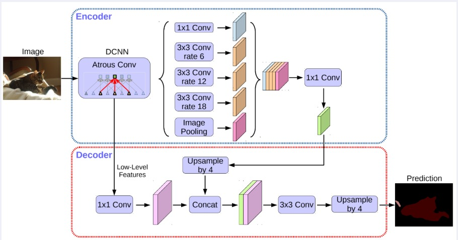

# Image-Segmentation
Road scene segmentation with DeepLabV3+ for self-driving cars. Includes TensorFlow model and visualization tools.

**Live Demo:** https://image-segmentation-w3rdpbpx5clruaj9tamshp.streamlit.app/

## Project Overview
This project focuses on road scene segmentation using the DeepLabV3+ model, a state-of-the-art architecture for semantic image segmentation. The goal is to enable accurate segmentation of road scenes, which is crucial for applications like self-driving cars.

## Features
- **DeepLabV3+ Model**: Utilizes TensorFlow for training and inference.
- **Label Definitions**: Includes detailed label definitions for various road scene elements such as roads, vehicles, and barriers.
- **Optimized Segmentation**: Implements efficient segmentation map conversion and data handling.
- **Visualization Tools**: Provides tools to visualize segmentation results.
- **Streamlit App**: Interactive web application for testing and visualizing segmentation results.

## Installation
1. Clone the repository:
   ```bash
   git clone https://github.com/your-repo/image-segmentation.git
   ```
2. Install the required dependencies:
   ```bash
   pip install -r requirements.txt
   ```

## Usage
- **Training**: Use the Jupyter Notebook `Image Segmentation DeepLabV3+ training.ipynb` to train the model.
  - Includes setup for label definitions and optimized data collection.
  - Provides helper functions for segmentation map conversion and image identifier extraction.
- **Visualization**: Run the Streamlit app using:
   ```bash
   streamlit run streamlit_app.py
   ```

## Data Preprocessing

### Listing All Unique Labels
The dataset contains various labels representing different elements in road scenes. The preprocessing step involves listing all unique labels present in the dataset.

### Creating Hugging Face Datasets
The dataset is converted into Hugging Face `Dataset` format for efficient handling and split into training, validation, and test sets.

### Mapping IDs to Labels
A mapping is created to hash IDs to their corresponding labels.

### Visualizing Sample Images and Segmentation Maps
Sample images and their segmentation maps are visualized without overlaying.

### Optimized Data Collection

The data collection process involves gathering raw images and their corresponding labels from specified directories. The images are resized to a consistent target size of `(256, 256)` for uniformity. Labels are converted into NumPy arrays using an optimized function for efficient handling.

#### Process
- **Directories**: Data is collected from subdirectories containing training images and label images.
- **Matching**: Each label image is matched with its corresponding training image using a unique identifier.
- **Conversion**: Images are resized and converted to NumPy arrays for further processing.
- **Error Handling**: Any mismatched or problematic files are skipped to ensure smooth data collection.

#### Summary
- **Target Image Size**: `(256, 256)`
- **Total Samples Collected**: The number of samples collected is displayed after the process completes.
- **Memory Cleanup**: Garbage collection is performed to free up memory after data collection.

## DeepLabV3+ Model

DeepLabV3+ is an advanced semantic segmentation model designed to accurately classify pixels in images. It leverages Atrous Spatial Pyramid Pooling (ASPP) for multi-scale feature extraction and a decoder module for refining segmentation results. The model uses ResNet101 as its backbone and is ideal for applications like road scene segmentation in self-driving cars.

- 

### Overview
The DeepLabV3+ model is a state-of-the-art architecture for semantic image segmentation. It combines Atrous Spatial Pyramid Pooling (ASPP) and a decoder module to achieve high-resolution segmentation results. This implementation uses TensorFlow and ResNet101 as the backbone.

### Features
- **Backbone**: ResNet101 pre-trained on ImageNet.
- **ASPP Module**: Extracts multi-scale features using atrous convolutions with different dilation rates.
- **Decoder Module**: Refines high-resolution features for accurate segmentation.
- **Global Average Pooling**: Captures global context information.
- **Dropout**: Regularization to prevent overfitting.

### Model Definition
The model is defined with the following components:

#### ASPP (Atrous Spatial Pyramid Pooling)
- Parallel atrous convolutions with dilation rates `[6, 12, 18, 24]`.
- Global average pooling branch for capturing global context.
- Concatenation of all ASPP outputs followed by 1x1 convolution and dropout.

#### Decoder Module
- Upsamples ASPP output to match high-resolution features.
- Refines high-resolution features using 1x1 convolution.
- Combines upsampled ASPP output with refined high-resolution features.
- Final convolutions for segmentation and upsampling to input image resolution.

### Checkpoint Handling
The model checks for existing checkpoints and loads them if available. Otherwise, it creates a new model instance.

## Training Results
After 30 epochs:
- Train Loss: 0.2826, Train Accuracy: 0.9314
- Validation Loss: 0.2825, Validation Accuracy: 0.9314

- 
- 
- 

## Requirements
See `requirements.txt` for a list of dependencies.

## License
This project is licensed under the MIT License.
